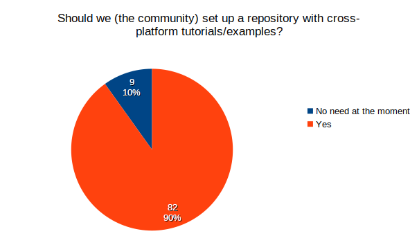
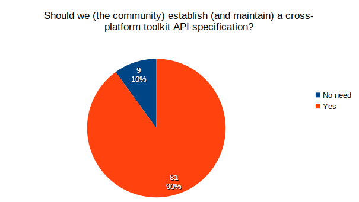
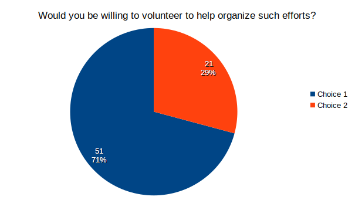
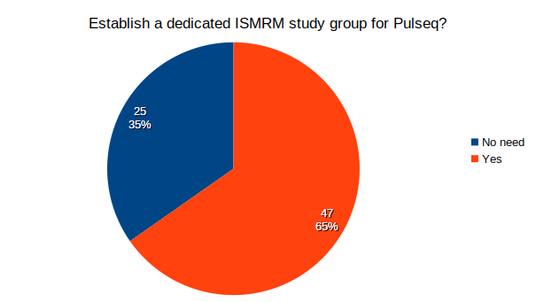
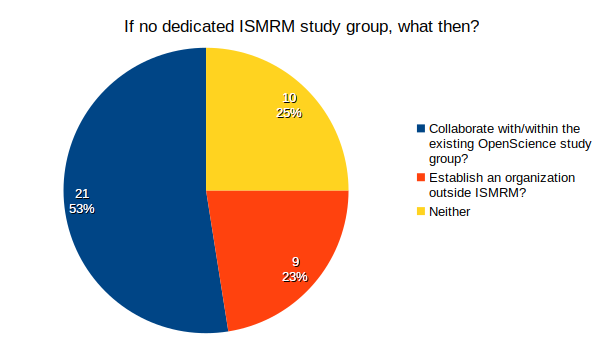
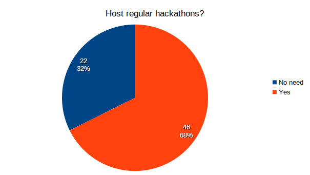
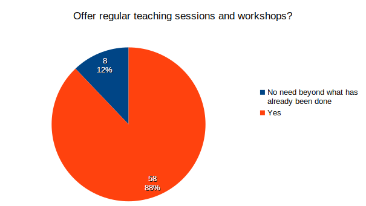
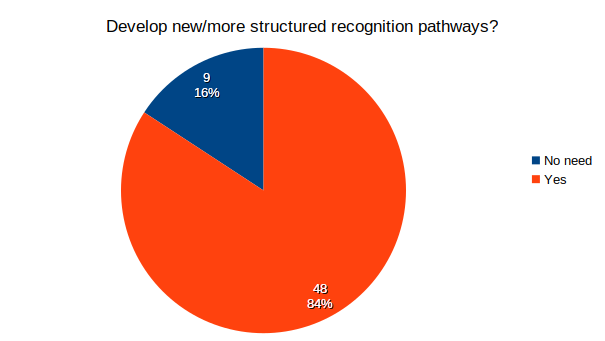
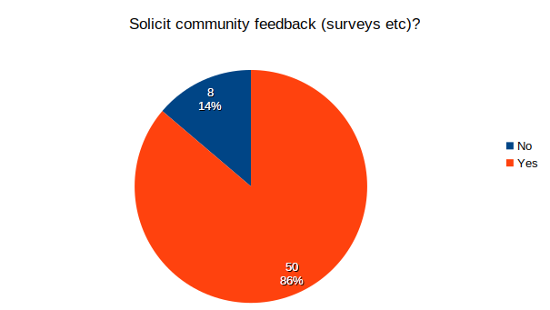

# Poll Results Day 2

## Poll 1: Community Effort to Harmonize API

| Question | Answers | Counts |
|----------|---------|--------|
| Should we (the community) set up a repository with cross-platform tutorials/examples? | No need at the moment | 9 |
| | Yes | 82 |

| Question | Answers | Counts |
|----------|---------|--------|
| Should we (the community) establish (and maintain) a cross-platform toolkit API specification? | No need | 9 |
| | Yes | 81 |

| Question | Answers | Counts |
|----------|---------|--------|
| Would you be willing to volunteer to help organize such efforts? | Choice 1* | 51 |
| | Choice 2* | 21 |

\* `Choice 1` and `Choice 2` are the data stored by Zoom, I have no way of recovering the actual answer options :-)

## Poll 2: ISMRM Study Group and Activities

| Question | Answers | Counts |
|----------|---------|--------|
| Establish a dedicated ISMRM study group for Pulseq? | No need | 25 |
| | Yes | 47 |

| Question | Answers | Counts |
|----------|---------|--------|
| If no to the previous question: | Collaborate with/within the existing OpenScience study group? | 21 |
| | Establish an organization outside ISMRM? | 9 |
| | Neither | 10 |

| Question | Answers | Counts |
|----------|---------|--------|
| Host regular hackathons? | No need | 22 |
| | Yes | 46 |

| Question | Answers | Counts |
|----------|---------|--------|
| Offer regular teaching sessions and workshops? | No need beyond what has already been done | 8 |
| | Yes | 58 |

| Question | Answers | Counts |
|----------|---------|--------|
| Develop new/more structured recognition pathways? | No need | 9 |
| | Yes | 48 |

| Question | Answers | Counts |
|----------|---------|--------|
| Solicit community feedback (surveys etc)? | No | 8 |
| | Yes | 50 |

